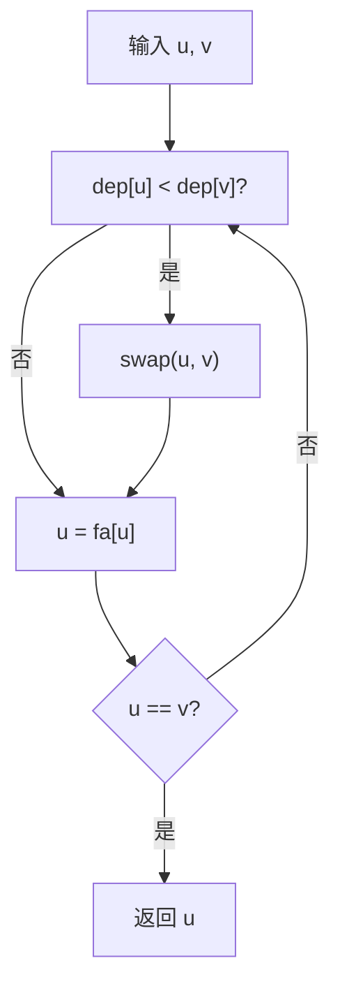
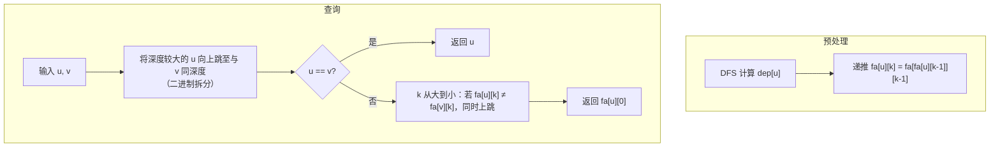
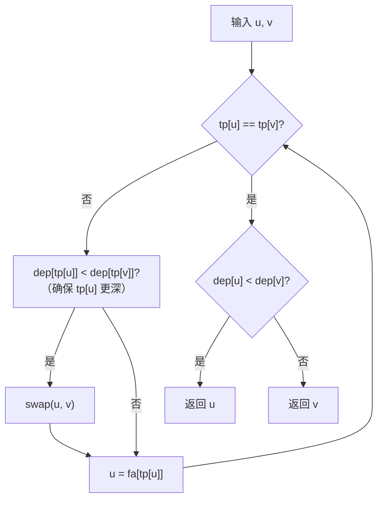
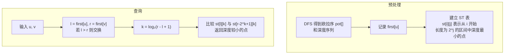
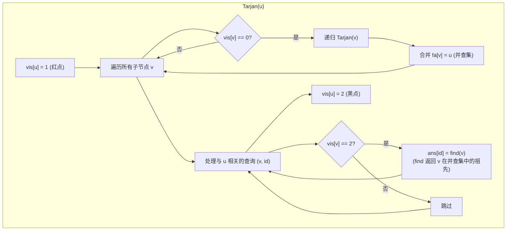

# 最近公共祖先 LCA

## 什么是 LCA

最近公共祖先（Lowest Common Ancestor，简称 LCA）是树上最基础的问题之一：**在一棵有根树中，两个节点的所有公共祖先里，深度最大（离根最远）的那个节点**，就是它们的 LCA。

举个例子：对于查询 $(u, v)$，它们的 LCA 同时是 $u$ 和 $v$ 的祖先，并且在所有公共祖先中离根最远。求解 LCA 是树上差分、树上路径查询、虚树构建等众多高级算法的基础。

接下来，我们由浅入深地介绍几种主流的 LCA 求法。


## 方法一：暴力跳父节点

这是最直观的方法。先通过一次 DFS 预处理出每个点的父节点 `fa[u]` 和深度 `dep[u]`，查询时不断将深度较大的节点向上跳，直到两个节点相遇。



**复杂度**：预处理 $O(n)$，单次查询 $O(n)$，$m$ 次查询总复杂度 $O(nm)$。

**评价**：实现极其简单，但当树退化为一条链时，每次查询可能遍历整棵树，在 $n$、$m$ 均达到 $5 \times 10^5$ 的模板题中完全无法通过。仅适合 $n$ 较小或树极为平衡的特殊场景。

```cpp
//参考代码
int lca(int u, int v) {
    while (u != v) {
        if (dep[u] < dep[v]) swap(u, v);
        u = fa[u];
    }
    return u;
}
```

## 方法二：倍增法

### 核心思想

倍增法的本质是**用二进制拆分来加速跳跃过程**。任意一个正整数都能唯一分解为若干个不相同的 $2$ 的幂次方之和，因此在树上向上跳跃时，可以将步数按二进制分解，一次跳跃 $2^k$ 步而非一步一步走。

### 预处理

定义 $fa_{i,k}$ 表示节点 $i$ 向上跳 $2^k$ 步后到达的点。通过递推式：

$$fa_{i,k} = fa_{fa_{i,k-1},\;k-1}$$

可以在一遍 DFS 中完成所有 $fa_{i,k}$ 的计算。

### 查询过程

查询分为两个阶段：

- **对齐深度**：将较深的节点向上跳，使两节点深度相同。利用二进制拆分，一次最多跳 $\log n$ 步。
- **同步上跳**：从大到小枚举 $k$，若 $fa_{u,k} \neq fa_{v,k}$ 则同时上跳。最终两节点停在 LCA 的正下方，LCA 即为 $fa_{u,0}$。



**复杂度**：预处理 $O(n \log n)$，单次查询 $O(\log n)$，空间 $O(n \log n)$。

**评价**：倍增法是竞赛中最常用的 LCA 求法，代码简洁，思想易懂，且可以方便地携带路径信息（如边权和、路径最大值），是非常通用的树上工具。缺点是常数略大，且无法做到 $O(1)$ 查询。

```cpp
//参考代码
struct LCA {
    int fa[N][20], dep[N];
    
    void dfs(int u, int f) {//预处理倍增节点
        fa[u][0] = f;
        dep[u] = dep[f] + 1;
        for (int i = 1; i < 20; i++) {
            fa[u][i] = fa[fa[u][i-1]][i-1];
        }
        for (auto v : G[u]) {
            if (v != f) dfs(v, u);
        }
    }
    
    int lca(int u, int v) {//跳接点找LCA
        if (dep[u] < dep[v]) swap(u, v);
        for (int k = 19; k >= 0; k--) {
            if (dep[fa[u][k]] >= dep[v]) u = fa[u][k];
        }
        if (u == v) return u;
        for (int k = 19; k >= 0; k--) {
            if (fa[u][k] != fa[v][k]) {
                u = fa[u][k];
                v = fa[v][k];
            }
        }
        return fa[u][0];
    }
};
```

## 方法三：树链剖分（重链剖分）

### 核心思想

树链剖分将树按子树大小划分为若干条**重链**，每条重链上的节点 DFS 序连续。关键性质是：**任意节点到根路径上的重链数量不超过 $\log n$** 条。

### 预处理

两遍 DFS：

- **第一遍**：计算深度 `dep`、父节点 `fa`、子树大小 `siz`、重儿子 `son`。
- **第二遍**：沿重儿子遍历形成重链，记录链顶 `tp` 和 DFS 序。

### 查询过程

只要两节点不在同一条重链上，就将链顶深度较大的节点跳到其链顶的父节点；当两节点处于同一条重链时，深度较小的即为 LCA。



**复杂度**：预处理 $O(n)$，单次查询 $O(\log n)$，空间 $O(n)$。

**评价**：虽然理论复杂度与倍增法相同，但常数往往更小（跳链比跳 $2^k$ 步更快）。树剖的真正价值在于：它不仅能求 LCA，还是树上路径修改/查询的**万能数据结构**，配合线段树可以处理几乎所有静态或动态的树上路径问题。

代码参见树链剖分章节：
    1. [HTML](/图论%20Graph/树%20Tree/重链剖分%20HLD/重链剖分%20HLD/)
    2. [Markdown](/viewer.html?file=%E5%9B%BE%E8%AE%BA%20Graph/%E6%A0%91%20Tree/%E9%87%8D%E9%93%BE%E5%89%96%E5%88%86%20HLD/%E9%87%8D%E9%93%BE%E5%89%96%E5%88%86%20HLD.md)

## 方法四：欧拉序 + ST 表

### 核心思想

对树做 DFS，每次进入节点或从子节点回溯时都记录该节点，得到长度为 $2n-1$ 的**欧拉序列**。一个重要性质是：**$u$ 和 $v$ 的 LCA，等于它们在欧拉序中第一次出现位置之间深度最小的节点**。

### 预处理与查询

- DFS 求出欧拉序和深度序列，记录每个节点在欧拉序中首次出现的位置。
- 对深度序列建立 ST 表（Sparse Table），预处理 $O(n \log n)$。
- 查询时找到 $u$ 和 $v$ 首次出现位置构成的区间，用 ST 表 $O(1)$ 查询区间最小深度对应的节点。



**复杂度**：预处理 $O(n \log n)$，单次查询 $O(1)$，空间 $O(n \log n)$。

**评价**：这是能做到**在线 $O(1)$ 查询**的经典方法，适合查询量极大且对实时性要求高的场景。但 ST 表的空间开销较大，实际运行中常数表现可能不如理论预期。


## 方法五：DFS 序 + ST 表（改进版）

这是欧拉序方法的变种。它利用 DFS 序（而非欧拉序）配合 ST 表，查询 $[dfn_u, dfn_v]$ 区间内深度最小的点的**父节点**作为 LCA（需特判 $u=v$ 和祖先关系的情况）。

**复杂度**：与欧拉序方法相同，预处理 $O(n \log n)$，查询 $O(1)$。

**评价**：这一改进使得常数比欧拉序方法更小（在洛谷模板题上仅需 869ms，甚至快于 Tarjan）。它和欧拉序方法共享同一套复杂度框架，但实际运行效率更高，是追求极致查询速度场景下的优选。

```cpp
struct LCA{
    vec<int> dfn,dfso,dept,fa;
    vec2<int> st;
    void build(const vec<int>& x,int n){
        int m = std::__lg(n);
        for(int i=1;i<=n;++i)st[i][0] = x[i];
        for(int j=1;j<=m;++j)
            for(int i=1;i+(1<<j)-1<=n;++i){
                int lnode = st[i][j-1],rnode = st[i+(1<<(j-1))][j-1];
                st[i][j] = dept[lnode]<dept[rnode]?lnode:rnode;
            }
    }
    int query(int L,int R){
        int z = std::__lg(R-L+1);
        int lnode = st[L][z],rnode = st[R-(1<<z)+1][z];
        return dept[lnode]<dept[rnode]?lnode:rnode;
    }
    int cnt = 0;
    void dfs(int u,int f,const vec2<int>& g){
        dfn[u] = ++cnt;
        dfso[dfn[u]] = u;
        fa[u] = f;
        dept[u] = dept[f] + 1;
        for(int v:g[u])if(v!=f)dfs(v,u,g);
    }
    int find(int a,int b){
        if(a==b)return a;
        int l = dfn[a],r = dfn[b];
        if(l>r)std::swap(l,r);
        return fa[query(l+1,r)]; // ← +1：排除祖先自身
    }
    LCA(int n,const vec2<int>& g){
        dfn.resize(n+1),dfso.resize(n+1),dept.resize(n+1),fa.resize(n+1);
        dfs(1,0,g);
        st.resize(n+1,vec<int>(std::__lg(n)+1,0));
        build(dfso,n);
    }
};
```

!!! warning "坑点（+1）"
    `find` 中 `query` 的区间必须是 `[l+1, r]` 而非 `[l, r]`。

    原因是：当 $a$ 是 $b$ 的祖先时，$[dfn_a, dfn_b]$ 内深度最浅的节点就是 $a$ 自身，`fa[a]` 返回的是 $a$ 的父节点而非 $a$。从 $dfn_a+1$ 开始查询就排除了祖先自身，此时区间内最浅节点的父节点恰好是 LCA。

    例如：
    ```
        1 (dfn=1)
       / \
    2(dfn=2) 3(dfn=3)
    ```
    `lca(1,2)`：区间 `[1,2]` 内最浅是 1，`fa[1]=0` ❌  
    正确：区间 `[2,2]` 内最浅是 2，`fa[2]=1` ✅

## 方法六：Tarjan 离线算法

### 核心思想

Tarjan 算法是一种**离线算法**：先将所有查询读入并存储，然后通过一遍 DFS 统一回答所有询问。

### 算法流程

利用并查集维护节点状态（白点：未访问；红点：正在访问；黑点：已回溯）。DFS 过程中：

1. 递归处理当前节点的所有子树。
2. 每处理完一个子树，将该子树与当前节点合并（并查集）。
3. 处理所有与当前节点相关的查询——若另一节点已经访问过（黑点），则两节点的 LCA 即为另一节点在并查集中的祖先。



**复杂度**：$O(n + m \cdot \alpha(n))$，其中 $\alpha(n)$ 为反阿克曼函数，近似常数。

**评价**：整体复杂度接近线性，是所有方法中最优的。但需要**离线**处理（一次性知道所有查询），且并查集常数的存在使得在数据量不大时未必比 DFS 序 + ST 表快。适合查询极多且允许批量处理的场景。


## 方法七：分块

一种不太常见的“根号”做法：将父节点序列按 $\sqrt{n}$ 大小分块，预处理每个点**跳出当前块后到达的第一个祖先**。查询时交替进行“大跳”（跳块间）和“小跳”（块内跳父节点），直到两点相遇。

**复杂度**：预处理 $O(n\sqrt{n})$，查询 $O(\sqrt{n})$。

**评价**：复杂度不占优势，实际表现甚至不如暴力。其主要价值在于**理论意义**——它支持父节点的动态修改，这一点是倍增、树剖等方法难以做到的。适合需要同时支持“修改父节点”和“查询 LCA”的特殊题目。


## 总结对比

| 方法 | 预处理 | 单次查询 | 在线/离线 | 空间复杂度 | 特点 |
|:---:|:---:|:---:|:---:|:---:|:---|
| **暴力** | $O(n)$ | $O(n)$ | 在线 | $O(n)$ | 最简单，仅适合极小数据 |
| **倍增** | $O(n \log n)$ | $O(\log n)$ | 在线 | $O(n \log n)$ | 最常用，易维护路径信息 |
| **树链剖分** | $O(n)$ | $O(\log n)$ | 在线 | $O(n)$ | 常数小，万能树上工具 |
| **欧拉序 + ST 表** | $O(n \log n)$ | $O(1)$ | 在线 | $O(n \log n)$ | 查询极快，空间较大 |
| **DFS 序 + ST 表** | $O(n \log n)$ | $O(1)$ | 在线 | $O(n \log n)$ | 查询极快，常数最小 |
| **Tarjan 离线** | $O(n)$ | $O(\alpha(n))$ | 离线 | $O(n+m)$ | 整体复杂度最优 |
| **分块** | $O(n\sqrt{n})$ | $O(\sqrt{n})$ | 在线 | $O(n)$ | 支持动态修改父节点 |

## 选型建议

以下是不同场景下的推荐选择：

1. **模板题 / 日常使用**：首选**倍增法**。代码简单，思路清晰，能处理绝大多数问题。

2. **查询量极大，追求极致速度**：选**DFS 序 + ST 表**。在线 $O(1)$ 查询，常数表现优异。

3. **需要同时维护树上路径**：选**树链剖分**。不仅能求 LCA，配合线段树可以处理路径修改和查询。

4. **允许离线，查询量极大**：选**Tarjan 离线算法**。整体复杂度最优，接近线性。

5. **需要动态修改树的形态**：考虑**分块法**或 Link-Cut Tree 等动态树结构。

实际做题时，不必追求“最优”算法，而应根据题目的数据范围、操作类型和实现难度选择最合适的工具。大多数情况下，倍增法和树链剖分已经足够覆盖需求。