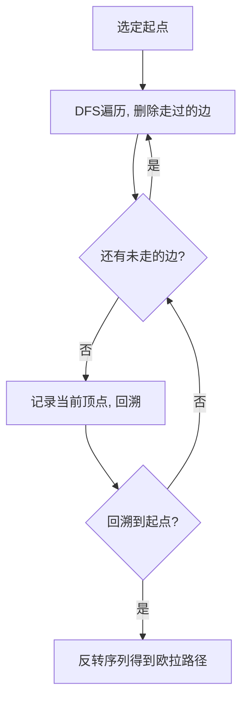

---
export_on_save:
  html: true
---

# 欧拉路问题 Euler Path

> 欧拉路是图论中的经典问题，源于**柯尼斯堡七桥问题**。欧拉在 1736 年证明该问题无解，由此开创了图论这一数学分支。

---

## 定义

1. **欧拉路径（Eulerian Trail）**：通过图中**每条边恰好一次**的路径（顶点可重复）。

2. **欧拉回路（Eulerian Circuit）**：通过图中**每条边恰好一次**且**起点等于终点**的路径。

3. **欧拉图与半欧拉图**
   - **欧拉图（Eulerian Graph）**：存在**欧拉回路**的图。
   - **半欧拉图（Semi-Eulerian Graph）**：存在**欧拉路径**但**不存在欧拉回路**的图。

4. **欧拉路与一笔画问题**
   > 欧拉路问题在实际中常被称为**"一笔画"问题**：能否一笔不重复地画出整个图形。

---

## 欧拉路的存在性

判断一个图是否存在欧拉路，需要同时检查**连通性**和**度数条件**。

### 无向图判断条件

#### 1. 弱连通判断

忽略边的方向（无向图天然无方向），去除**孤立点**（度数为 0 的点）后，剩余部分应构成一个连通图。

> 若图不连通，显然不可能有一条路径覆盖所有边。

```cpp
// 检查无向图弱连通（忽略孤立点）
void dfs(int u, int fa) {
    for (const int v : g[u]) if (!vis[v]) vis[v] = true, dfs(v, u);
}

bool check_connectivity() {
    int start = -1;
    for (int i = 0; i < n && start == -1; ++i)
        if (deg[i] > 0) start = i;
    if (start == -1) return true;        // 无边图
    vis[start] = true;
    dfs(start, -1);
    for (int i = 0; i < n; ++i)
        if (!vis[i] && deg[i]) return false;
    return true;
}
```

#### 2. 度数判断

记 $deg(u)$ 为顶点 $u$ 的度数（无向图中与之关联的边数）。

| 条件 | 结论 | 图类型 |
|:---|:---|:---|
| 所有顶点度数均为**偶数** | 存在**欧拉回路** | **欧拉图** |
| **恰有两个**顶点度数为奇数 | 存在**欧拉路径**（以奇度点为起/终点） | **半欧拉图** |
| 奇数度顶点个数 $> 2$ | **不存在**欧拉路 | ❌ |

> **证明概要**：
> - 必要性：在欧拉回路中，每进入一个顶点必从该顶点离开，因此贡献度数为 2 的倍数。
> - 充分性：可用 Hierholzer 算法构造性证明。

```cpp
// 检查度数条件，返回欧拉路径的起点
int check_degree() {
    int cnt = 0, even_start = -1;  // cnt: 奇度顶点个数
    for (int i = 0; i < n; ++i) {
        if (!deg[i]) continue;
        if (deg[i] % 2 == 1) ++cnt;
        else even_start = i;
    }
    if (cnt == 0) return even_start;       // 欧拉回路，任选一点
    if (cnt == 2) return /* 奇度点之一 */; // 欧拉路径
    return -1;                              // 无解
}
```

---

### 有向图判断条件

#### 1. 弱连通判断

将每条有向边视为无向边后（即忽略方向），检查去除孤立点后是否连通。方法同上。

#### 2. 度数判断

记 $in(u)$ 为入度，$out(u)$ 为出度。

| 条件 | 结论 | 图类型 |
|:---|:---|:---|
| 所有顶点 $in(u) = out(u)$ | 存在**欧拉回路** | **欧拉图** |
| 恰有一个顶点 $out = in + 1$（起点），<br>恰有一个顶点 $in = out + 1$（终点），<br>其余顶点 $in = out$ | 存在**欧拉路径** | **半欧拉图** |
| 其他情况 | **不存在**欧拉路 | ❌ |

> - 起点多一条出边，终点多一条入边，这是显而易见的。

---

## 欧拉路的寻找：Hierholzer 算法

Hierholzer 算法是求解欧拉路的经典算法，时间复杂度 **$O(E)$**（若需排序则为 $O(E \log E)$）。

### 算法思想

该算法的核心是**贪心深搜 + 回溯拼接**：

1. **选定起点**（根据度数条件）。
2. 从起点开始 DFS，每经过一条边就**删除**它（避免重复使用）。
3. 当某个顶点无路可走时，将其**入栈/记录**。
4. 最终沿 DFS 树回溯，记录的顶点序列的**反转**即为欧拉路径。

这个过程可以理解为：从起点出发，先走出一个环，在回溯时将其他环"拼接"进来。



### 1. 确定起点

优先形成欧拉回路；若无法形成回路，则形成欧拉路径。

#### 无向图

- 若所有点度数为偶数 → 任选一个非孤立点（通常选编号最小的）作为起点。
- 若恰有两个奇度点 → 选**编号较小**的那个奇度点作为起点（确保字典序最小）。

#### 有向图

- 若所有点 $in = out$ → 任选一个点。
- 若存在 $out = in + 1$ 的点 → 该点为起点。

#### 字典序最小要求

很多题目要求输出**字典序最小**的欧拉路径。解决方法：对每个顶点的邻接表**排序**，在 DFS 时按顺序遍历。

```cpp
// 对邻接表排序，保证路径字典序最小
for (int i = 0; i < n; ++i)
    sort(g[i].begin(), g[i].end());
```

### 2. 递归寻找（DFS + 删边）

核心递归函数 `find_path(u)`：

- 遍历顶点 $u$ 的所有邻接点 $v$。
- 如果边 $(u, v)$ 还存在（即 `e[u][v] > 0`），则删除该边并递归进入 $v$。
- 回溯时将 $u$ 加入答案序列。

```cpp
/// 寻找欧拉路（无向图版）
void find_path(int u) {
    for (const int v : g[u]) {
        if (e[u][v] && e[v][u]) {   // 边还存在
            --e[u][v];              // 删除边（处理重边）
            --e[v][u];
            find_path(v);
        }
    }
    ans += rev(u);                  // 回溯时记录顶点
}
```

> **关于重边的处理**：由于使用邻接矩阵 `e[u][v]` 计数而非简单的 `bool`，可以正确处理重边的情形。

### 3. 还原答案

DFS 过程中记录的顶点顺序是**逆序**的（因为回溯时才记录），因此最后需要**反转**得到正确的欧拉路径。

```cpp
find_path(start);
reverse(ans.begin(), ans.end());
cout << ans;
```

---

## 完整代码模板

以下代码改编自 [P1341 无序字母对](https://www.luogu.com.cn/problem/P1341) 的解法，完整实现了无向图欧拉路径的判定与求解：

[**完整代码**](/Code/viewer.html?file=P1341.cpp) <!-- 请将路径改为实际仓库中的相对路径 -->

```cpp
#include <bits/stdc++.h>
using namespace std;

const int maxn = 26 * 2;  // 'A'-'Z' (0-25), 'a'-'z' (26-51)
vector<int> g[maxn];      // 邻接表
int deg[maxn];            // 度数
bool vis[maxn];           // 连通性 DFS 标记
int e[maxn][maxn];        // 邻接矩阵（处理重边）
string ans;

// 字符 ↔ 编号 映射
auto mp = [](char z) { return isupper(z) ? z - 'A' : z - 'a' + 26; };
auto rev = [](int z) -> char { return z < 26 ? 'A' + z : 'a' + z - 26; };

// 连通性检查
void dfs(int u) {
    for (int v : g[u])
        if (!vis[v]) vis[v] = true, dfs(v);
}

bool check_connectivity() {
    int start = -1;
    for (int i = 0; i < maxn; ++i)
        if (deg[i] > 0) { start = i; break; }
    if (start == -1) return true;
    vis[start] = true;
    dfs(start);
    for (int i = 0; i < maxn; ++i)
        if (!vis[i] && deg[i]) return false;
    return true;
}

// 度数检查，返回起点
int check_degree() {
    int cnt = 0, odd_start = -1, even_start = -1;
    for (int i = 0; i < maxn; ++i) {
        if (!deg[i]) continue;
        if (deg[i] & 1) ++cnt, (odd_start == -1 ? odd_start : even_start) = i;
        else even_start = i;
    }
    if (cnt == 0) return even_start;     // 欧拉回路
    if (cnt == 2) return odd_start;      // 欧拉路径，取奇度点
    return -1;                            // 无解
}

// Hierholzer 算法
void find_path(int u) {
    for (int v : g[u]) {
        if (e[u][v] && e[v][u]) {
            --e[u][v], --e[v][u];
            find_path(v);
        }
    }
    ans += rev(u);
}

int main() {
    // ... 读入数据、建图 ...
    if (!check_connectivity()) { cout << "No Solution"; return 0; }
    int start = check_degree();
    if (start == -1) { cout << "No Solution"; return 0; }
    // 排序邻接表保证字典序最小
    for (int i = 0; i < maxn; ++i) sort(g[i].begin(), g[i].end());
    find_path(start);
    reverse(ans.begin(), ans.end());
    cout << ans;
    return 0;
}
```

---

## 算法步骤图解

以下图为例，演示 Hierholzer 算法的执行过程：

```
图:  A — B — C — D
     |   |       |
     E — F — G — H
```

1. 起点选为 A（所有点度数为偶）。
2. DFS：A→B→C→D→H→G→F→E→A，走完一个环。
3. 回溯过程中，B 处还有未走边 B→F，进入子环：B→F→C→··· 继续。
4. 最终记录的序列反转后得到正确欧拉路径。

---

## 欧拉路的应用

1. **一笔画问题**：判断图形能否一笔不重复地画出，并输出画法。

2. **DNA 片段组装**：在生物信息学中，将 DNA 读段（reads）拼接为完整序列时，可建模为**有向欧拉路径**问题（de Bruijn 图）。

3. **电路设计**：在 PCB 布线中，寻找访问所有线路的最优路径。

4. **邮路问题**：中国邮递员问题（Chinese Postman Problem）要求在加权图中找到经过每条边至少一次的最短回路。当图中存在奇度顶点时，需通过添加重复边使其变为欧拉图。

5. **迷宫求解**：将所有通道抽象为边，岔路口为顶点，欧拉路径可用于设计一次性遍历所有通道的路线。

6. **字谜与密码**：如 P1341 "无序字母对" 问题，给定若干字母对，求包含所有字母对的最短字符串，转化为无向图欧拉路径求解。

---

## 相关题目

| 题目 | 难度 | 说明 |
|:---|:---:|:---|
| [P1341 无序字母对](https://www.luogu.com.cn/problem/P1341) | ⭐⭐⭐ | 无向图欧拉路径模板题 |
| [P2731 骑马修栅栏](https://www.luogu.com.cn/problem/P2731) | ⭐⭐⭐ | 无向图欧拉路径，要求字典序最小 |
| [P1333 瑞瑞的木棍](https://www.luogu.com.cn/problem/P1333) | ⭐⭐⭐ | 无向图欧拉路径 + 字符串哈希 |
| [P3520 [POI2011] SMI-Garbage](https://www.luogu.com.cn/problem/P3520) | ⭐⭐⭐⭐ | 欧拉回路 + 边分类 |
| [UVA10054 The Necklace](https://uva.onlinejudge.org/external/100/10054.pdf) | ⭐⭐⭐ | 无向图欧拉回路 |
| [P7684 [CEOI2008] order](https://www.luogu.com.cn/problem/P7684) | ⭐⭐⭐⭐⭐ | 有向图欧拉路径 |

---

## 总结

| 概念 | 要点 |
|:---|:---|
| **欧拉路径** | 经过每条边恰好一次 |
| **欧拉回路** | 欧拉路径 + 起点等于终点 |
| **无向图判定** | 连通 + 奇度点数为 0 或 2 |
| **有向图判定** | 弱连通 + 出入度差为 0 或恰有 ±1 两点 |
| **求解算法** | Hierholzer：DFS 删边，回溯记录，反转输出 |
| **时间复杂度** | $O(E)$（排序后 $O(E \log E)$） |

> **一句话总结**：欧拉路就是"一笔画"，其存在取决于图的连通性与度数分布，而 Hierholzer 算法提供了优雅的构造性求解方法。

## AIGC

本文章使用 Deepseek V4 Flash 依据给定叙述架构和自有代码生成。