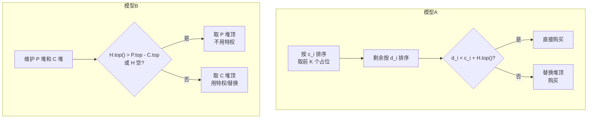
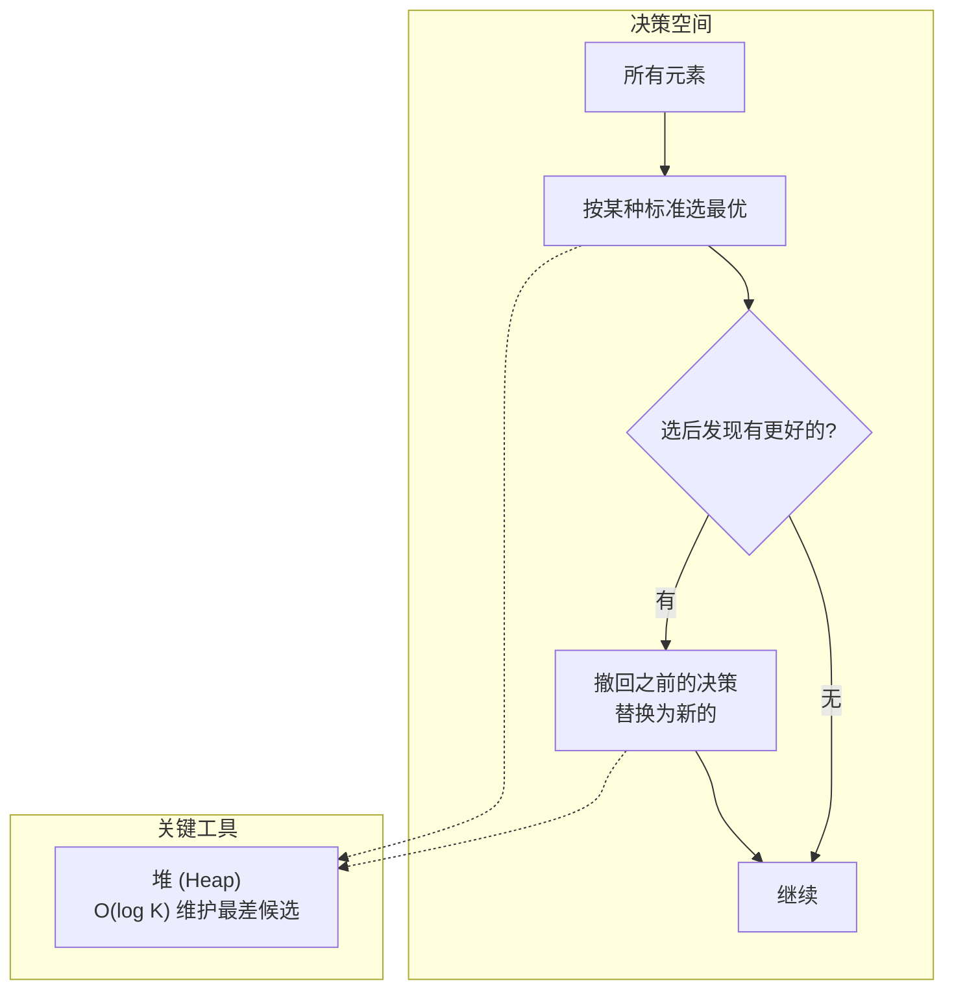

# 反悔贪心（Regret Greedy）

## 一、动机与背景

### 1.1 贪心的失效

贪心算法每一步都做出当前最优的选择，但当问题存在 **配额（quota）约束** 时，早期的一个贪心决策可能阻碍后续获得全局更优的解。

> 用数学语言描述：设 $S$ 为元素集合，每个元素 $i$ 有两个代价 $a_i \le b_i$，最多 $K$ 个元素可以享受 $a_i$ 的低代价。贪心策略若先固定享受 $a_i$ 的 $K$ 个元素，再考虑其余的，则可能由于 **已选元素本身不优** 而无法达到全局最优。

!!! warning "经典失效场景"
    选择 $a_i$ 最小的 $K$ 个元素，但其中某些元素的 $b_i - a_i$ 过小（甚至为 $0$），导致配额被浪费，而后面本应享受配额的元素反而无法获得。

### 1.2 反悔贪心的思想

反悔贪心在普通贪心的基础上引入 **撤销机制**：允许将某个已获得配额的元素 **降级**，让出配额给更优的元素，同时通过 **堆** 来维护降级带来的额外代价。

从另一个角度看，反悔贪心等价于维护一个大小为 $K$ 的 **可替换集合**，并动态维护集合中"最差"的那个元素以备替换。

---

## 二、形式化定义

### 2.1 问题模型

给定 $N$ 个元素，每个元素 $i$ 有两个代价 $c_i \le d_i$，以及 $K$ 个 **升级特权**（使用特权时代价为 $c_i$，否则为 $d_i$）。在总预算 $M$ 内最大化选取的元素个数。

等价形式：每个元素 $i$ 的基础代价 $d_i$，使用特权后减免 $s_i = d_i - c_i$，最多 $K$ 次减免。

### 2.2 反悔机制

记已使用特权的元素集合为 $U$（$|U| \le K$）。当考虑新元素 $j$ 时：

$$
\operatorname{cost}(j) = \min\!\Bigg( d_j,\; \min_{i \in U} \big( c_j + s_i \big) \Bigg)
$$

其中 $\displaystyle \min_{i \in U} s_i$ 可以通过维护一个小根堆 $H$（存储 $\{s_i \mid i \in U\}$）在 $O(\log K)$ 时间内获得。

当选择特权方式（即 $c_j + \min s_i < d_j$）时，执行替换：

1. 从 $U$ 中移除 $i^* = \arg\min s_i$（堆顶出堆）
2. 将 $j$ 加入 $U$（$s_j$ 入堆）

??? tip "堆的初始化"
    - 若 $K$ 个特权一开始均可自由使用，则堆中预填 $K$ 个 $0$（表示"免费撤销、不损失任何减免"）
    - 若特权需要满足某种条件才能获得，则堆初始为空，每当获得一个新特权时才入堆

---

## 三、算法框架

### 3.1 通用模板

$$
\begin{array}{l}
\textbf{Input: } \{d_i\}_{i=1}^N,\ \{c_i\}_{i=1}^N,\ K,\ M \\
\textbf{Output: } \max\{|S| \mid S \subseteq [N],\ \operatorname{cost}(S) \le M\} \\\\
1.\quad H \gets \text{min-heap}() \\
2.\quad \textbf{for } t \gets 1 \textbf{ to } K \textbf{ do } H.\text{push}(0) \qquad (\text{初始空闲特权}) \\
3.\quad \textbf{while } \exists\ \text{可选元素} \textbf{ do} \\
4.\quad\quad (d_{\min}, i_d) \gets \text{全集中代价 } d \text{ 最小的未选元素} \\
5.\quad\quad (c_{\min}, i_c) \gets \text{全集中代价 } c \text{ 最小的未选元素} \\
6.\quad\quad \textbf{if } H.\text{empty}() \lor H.\text{top}() > d_{\min} - c_{\min} \textbf{ then} \\
7.\quad\quad\quad \text{cost} \gets d_{\min} \qquad (\text{不使用特权}) \\
8.\quad\quad\quad \text{标记 } i_d \text{ 为已选} \\
9.\quad\quad \textbf{else} \\
10.\quad\quad\quad \text{cost} \gets c_{\min} + H.\text{top}() \qquad (\text{使用特权 / 替换}) \\
11.\quad\quad\quad H.\text{pop}();\ H.\text{push}(s_{i_c}) \\
12.\quad\quad\quad \text{标记 } i_c \text{ 为已选} \\
13.\quad\quad \textbf{if } M \ge \text{cost} \textbf{ then } M \gets M - \text{cost};\ \text{ans} \gets \text{ans} + 1 \\
14.\quad\quad \textbf{else break}
\end{array}
$$

### 3.2 正确性要点

!!! note "正确性依据"
    该算法本质上是 **拟阵（Matroid）贪心** 的推广：
    
    - 所有元素构成一个 **拟阵**，独立集为任意大小不超过 $K$ 的特权使用集合；
    - 每次选择"增加代价最小"的元素，并维护拟阵的独立集性质；
    - 堆中存储的 $s_i$ 实际是该元素加入独立集后带来的 **边际代价**。
    
    当特权替换的代价可精确计算时，该贪心给出全局最优解。

### 3.3 与 DP 的对比

$$
\begin{array}{c|cc}
& \text{反悔贪心} & \text{DP} \\ \hline
\text{时间复杂度} & O(N \log N) & O(NK) \\
\text{空间复杂度} & O(N + K) & O(NK) \\
\text{适用条件} & \text{替换代价可计算} & \text{任意} \\
K \sim \Theta(N) \text{ 时} & \checkmark\ O(N \log N) & \times\ O(N^2)
\end{array}
$$

---

## 四、两种实现模型

### 4.1 模型 A：两阶段法

$$
\begin{array}{l}
1.\ \text{按 } c_i \text{ 升序排序，取前 } K \text{ 个作为初始 } U \\
2.\ \text{剩余元素按 } d_i \text{ 升序排序} \\
3.\ \text{对每个剩余元素 } j \textbf{ do} \\
4.\quad \textbf{if } H.\text{empty}() \lor d_j \le c_j + H.\text{top}() \textbf{ then} \\
5.\quad\quad \text{直接以代价 } d_j \text{ 购买} \\
6.\quad \textbf{else} \\
7.\quad\quad \text{以代价 } c_j + H.\text{top}() \text{ 替换购买}
\end{array}
$$

> **适用条件**：前 $K$ 个元素 **一定值得选取**（即 $c_i$ 足够小，不会导致预算被卡死）

### 4.2 模型 B：双堆同步法

$$
\begin{array}{l}
1.\ \text{同时维护 } \{d_i\} \text{ 和 } \{c_i\} \text{ 两个小根堆} \\
2.\ H \gets \text{min-heap}(), \text{ 预填 } K \text{ 个 } 0 \\
3.\ \textbf{while } \text{堆非空} \textbf{ do} \\
4.\quad d_{\min} \gets \text{堆 } P \text{ 顶}, \quad c_{\min} \gets \text{堆 } C \text{ 顶} \\
5.\quad \textbf{if } H.\text{empty}() \lor H.\text{top}() > d_{\min} - c_{\min} \textbf{ then} \\
6.\quad\quad \text{选 } d_{\min} \text{ 路径} \\
7.\quad \textbf{else} \\
8.\quad\quad \text{选 } c_{\min} + H.\text{top}() \text{ 路径}
\end{array}
$$

> **适用条件**：占位元素可能不值得选取，需动态决策

---

## 五、堆的选择策略

| 堆类型 | 用途 | 理论依据 |
|--------|------|---------|
| **小根堆** | 维护"最应被替换的元素"——权值最小的 $s_i$ | 替换时需最小化额外代价 $c_j + \min s_i$ |
| **大根堆** | 维护"收益最大的元素"——选最有价值的替换目标 | 替换时需最大化总收益 |

> **命题**：若算法正确，替换操作总是移除 $U$ 中 $s_i$ **最小**（小根堆）或收益 **最大**（大根堆）的元素。移除的准则取决于问题的最小化或最大化目标。

---

## 六、与 WQS 二分的关系

反悔贪心也可视为 **WQS 二分（Alien's Trick）** 的离散模拟：

- WQS 二分引入参数 $\lambda$ 作为特权使用的额外成本，通过二分 $\lambda$ 来控制特权使用数量
- 反悔贪心通过堆来直接 **显式维护** 替换代价，无需二分

$$
\text{反悔贪心: } \min s_i \quad\longleftrightarrow\quad \text{WQS: } \lambda
$$

两者本质等价，但反悔贪心的常数更小，实现更简洁，适用于 $N$ 较小但 $K$ 较大的场景。

---

## 七、例题一览

| 题目 | 模型 | 特权含义 | $s_i$ | 关键比较 |
|------|------|---------|-------|---------|
| 洛谷 P3045 | B | 优惠券减价 | $P_i - C_i$ | $P_{\min}$ vs $C_{\min} + \min s_i$ |
| 洛谷 P1792 | A | 相邻树苗 | 收益 $w_i$ | 种 vs 不种 |
| 洛谷 P2168 | A | $k$ 叉合并 | 合并代价 | 类似 Huffman |
| CF 865D | A | 买卖时机 | 买入价 | $p_i$ vs $p_i - \min s_i$ |

---

## 八、边界与细节

!!! warning "堆空检查"
    当 $K = 0$ 或所有特权均已使用时，$H$ 可能为空。此时只能选择 $d_{\min}$ 路径，务必在使用 $H.\text{top}()$ 之前检查 $H.\text{empty}()$。

!!! warning "特权零节省"
    当 $s_i = 0$ 时，元素 $i$ 使用特权无任何收益。将此元素加入 $U$ 会浪费一个配额，且堆中出现 $0$ 导致后续替换的额外代价为 $0$，可能触发不公平的替换。建议：

    - 预处理：将 $s_i = 0$ 的元素视为无特权需求的元素
    - 或让堆中的 $0$ 在替换时自动流动（双堆模型天然支持）

!!! warning "初始占位可能买错"
    模型 A 第一阶段可能将配额分配给不值得选取的元素，导致预算被锁死。此时应改用模型 B。

---

## 九、思维总结

反悔贪心的本质是 **在贪心决策的基础上增加一个"撤回"的选项**，使得算法可以在保持 $O(N \log N)$ 复杂度的同时，处理原本需要 $O(NK)$ DP 才能求解的一类问题。

### 判断三要素

1. **存在配额 $K$** —— 否则是普通贪心
2. **替换有可计算的代价** —— 否则无法维护堆
3. **决策具有单调性** —— 早期的决策在后期不会变得更好（否则需要 DP 而非贪心）
