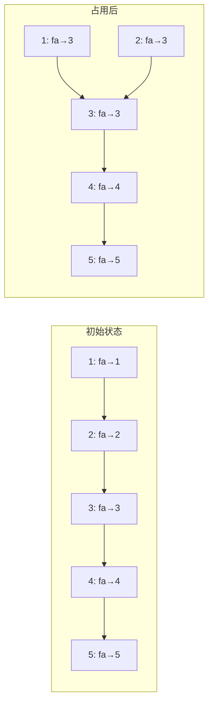

---
export_on_save:
  html: true
---
# 并查集（DSU）

用于快速判断元素是否属于同一个集合。

## 支持操作

1. 将两个元素放到同一个集合中。

2. 查询两个元素是否属于同一个集合。

## 代表元素思想

选择一个元素作该集合的代表元素，其他需要添加的元素作为这个代表元素的儿子，形成一颗树。

把判断**集合与元素**间的从属转化为**集合与集合**间的关系，通过递归查找。

## 实现方式

1.  路径压缩

简单来说，每次都递归查找太麻烦了！我们记录下每次查询的结果，查询时就可以直接调用。

2.  按秩合并

用于在合并两个集合时尽量保持并查集的树高度较小，防止形成长链。

---

通过上述两种方式，我们可以避免可能途径的超长递归链，以此减少查询的时间开销。

## Code

```cpp
namespace dsu{
	int fa[maxn];
	inline void init(int x){for(int i=1;i<=x;i++)fa[i] = i;}
	inline int find(int a){return fa[a]==a?a:fa[a] = find(fa[a]);}
	inline void merge(int a,int b){fa[find(a)] = find(b);}
	inline bool check(int a,int b){return find(a)==find(b);}
}
```

## 例题

[P3367 【模板】并查集](https://www.luogu.com.cn/problem/P3367)

```cpp
#include <cstdio>
#define int long long
using namespace std;
const int maxn = 2e5+5;
int n,m,opt,x,y;
namespace dsu{
	int fa[maxn];
	inline void init(int x){for(int i=1;i<=x;i++)fa[i] = i;}
	inline int find(int a){return fa[a]==a?a:fa[a] = find(fa[a]);}
	inline void merge(int a,int b){fa[find(a)] = find(b);}
	inline bool check(int a,int b){return find(a)==find(b);}
}

signed main(){
	scanf("%lld%lld",&n,&m);
	for(int i=1;i<=n;i++)dsu::fa[i]=i;
	while(m--){
		scanf("%d%d%d",&opt,&x,&y);
		if(opt==1) dsu::merge(x,y);
		else printf("%c\n",dsu::check(x,y)?'Y':'N');
	}
	return 0;
}
```

---

## DSU 跳跃（并查集维护下一个未访问位置）

> 又称 **并查集跳跃**、**DSU 维护下一个未占用位置**（DSU guided jump）

### 核心思想

将并查集用于**快速跳过已被"占用"的位置**，而非传统意义上的集合合并。每个位置要么**未占用**，要么**已占用**。通过并查集的路径压缩特性，可以在 $O(\alpha(n))$ 时间内找到右边第一个未被占用的位置。

### 模型建立

| 状态 | `fa[x]` 的含义 |
|:-----|:---------------|
| 未占用 | `fa[x] = x`（指向自身） |
| 已占用 | `fa[x] = find(x+1)`（指向右边第一个未占用位置） |

### 核心操作

```cpp
int find(int x){
    return fa[x]==x ? x : fa[x]=find(fa[x]);
}
void occupy(int x){
    fa[x] = find(x+1);
}
```

- `find(x)`：返回 $\ge x$ 的第一个未占用位置（含 $x$ 自身）
- `occupy(x)`：标记 $x$ 为已占用，并将其父指针指向下一个未占用位置

### 可视化



当位置 1 和 2 被占用后，`fa[1]` 和 `fa[2]` 都指向了 3，`find(1)` 直接返回 3。

### 经典应用场景

!!! tip "适用条件"
    适用于需要**倒序处理区间赋值**（后覆盖先）的问题，每个位置只需被赋值一次。

| 问题类型 | 说明 |
|:---------|:-----|
| 区间染色/涂色 | 多次区间覆盖，只关心最终颜色 |
| 连续区间的删除/占用 | 每次删除若干位置，快速找到下一段未删除区间 |
| 区间交/并的模拟 | 倒序处理区间操作，避免重复遍历 |

### 例题：[P2391 白雪皑皑](https://www.luogu.com.cn/problem/P2391)

#### 题意简述

$n$ 片雪花，$m$ 次染色操作。第 $i$ 次将 $[L_i,R_i]$ 染成颜色 $i$，后染覆盖先染。求最终每片雪花的颜色。

$$
L_i = ((i \times p + q) \bmod n) + 1,\quad
R_i = ((i \times q + p) \bmod n) + 1
$$

$n \le 10^6$，$m \le 10^7$。

#### 核心思路

**倒序处理** + **DSU 跳跃**：

1. 从 $i=m$ 到 $1$ 倒序操作
2. 对区间 $[l,r]$，用 DSU 找到其中所有未被染色的位置，染上颜色 $i$
3. 每个位置只会被染色一次，总复杂度 $O(n \alpha(n) + m)$

#### 代码实现

```cpp
#include<bits/stdc++.h>
#define int long long
using namespace std;
template<typename T>using vec = std::vector<T>;

struct DSU{
    vec<int>fa;
    int find(int x){
        return fa[x]==x ? x : fa[x]=find(fa[x]);
    }
    void tag(int x){
        fa[x] = find(x+1);
    }
    DSU(int n){
        fa.resize(n+2);
        for(int i=0;i<=n+1;i++) fa[i] = i;
    }
};

signed main(){
    cin.tie(0)->sync_with_stdio(0);
    int n,m,p,q;
    cin>>n>>m>>p>>q;
    DSU d(n);
    vec<int>col(n+1);
    for(int i=m;i>=1;--i){
        int l = (i*p+q)%n + 1;
        int r = (i*q+p)%n + 1;
        if(l>r) swap(l,r);
        for(int pos=d.find(l);pos<=r;pos=d.find(pos)){
            d.tag(pos);
            col[pos] = i;
        }
    }
    for(int i=1;i<=n;i++) cout<<col[i]<<'\n';
    return 0;
}
```

!!! info "复杂度"
    - 时间复杂度：$O(n \alpha(n) + m)$
    - 空间复杂度：$O(n)$

#### 与普通 DSU 的对比

| 特性 | 普通 DSU | DSU 跳跃 |
|:-----|:---------|:---------|
| 合并方向 | 两个集合 $\to$ 一个 | 当前位置 $\to$ 下一个位置 |
| `find` 含义 | 找代表元素 | 找下一个未占用位置 |
| 典型路径 | `fa[x] = find(y)` | `fa[x] = find(x+1)` |
| 应用场景 | 图连通性、等价关系 | 区间跳过、连续占用 |