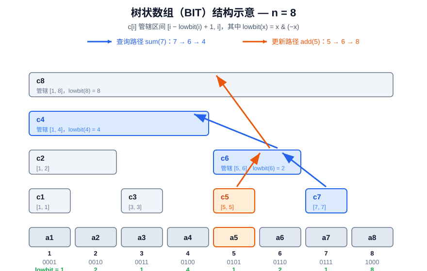

# 树状数组 BIT（Binary Indexed Tree / Fenwick Tree）

## 问题

**单点修改 + 前缀和查询** 的高效维护，进而支持**区间和查询**（$\text{sum}(r) - \text{sum}(l-1)$）。

## 原理

### 核心：lowbit

$$\text{lowbit}(x) = x \mathbin{\&} (-x)$$

即 $x$ 二进制表示中**最低位的 1** 所代表的值。例如 $\text{lowbit}(6) = \text{lowbit}(0110_2) = 2$。

### 管辖区间的划分

树状数组并不显式建树，而是用一个普通数组 $c$ 模拟一棵树：$c[i]$ 存储区间 $[i - \text{lowbit}(i) + 1,\ i]$ 的和。也就是说，**$c[i]$ 管辖以 $i$ 结尾、长度为 $\text{lowbit}(i)$ 的一段**。



如上图（$n=8$）：$c_4$ 管辖 $[1,4]$，$c_6$ 管辖 $[5,6]$，$c_8$ 管辖整个 $[1,8]$。

### 查询：前缀和

求 $\text{sum}(x)$ 时，从 $c[x]$ 出发，每次令 $x \leftarrow x - \text{lowbit}(x)$，把沿途的 $c$ 值累加，直到 $x = 0$。每次恰好去掉最低位的 1，最多 $\log n$ 步。例如：

$$\text{sum}(7) = c_7 + c_6 + c_4 \quad (7 \to 6 \to 4 \to 0)$$

### 更新：单点加

给 $a[x]$ 加上 $v$ 时，从 $c[x]$ 出发，每次令 $x \leftarrow x + \text{lowbit}(x)$，把沿途所有**管辖范围覆盖 $x$** 的 $c$ 值都加上 $v$，直到越界。例如 $a_5$ 加 $v$ 要更新 $c_5, c_6, c_8$。

!!! info 详见
    [OI Wiki - 树状数组](https://oi-wiki.org/ds/fenwick/)

## 代码模板

```cpp
struct BIT{
    const int n;vec<int>c;
    BIT(int _n):n(_n),c(n+1,0){};
    int lowbit(int x){return x&-x;}
    void add(int x,int v){//单点加：a[x] += v
        for(;x<=n;x+=lowbit(x))c[x] += v;
    }
    int sum(int x){//前缀和：a[1] + ... + a[x]
        int res = 0;
        for(;x>0;x-=lowbit(x))res += c[x];
        return res;
    }
};
```

两个操作都是 $O(\log n)$，且常数极小、代码极短，这是树状数组最大的魅力。

## 应用

### 区间和查询 —— [P3374 【模板】树状数组 1](https://www.luogu.com.cn/problem/P3374)

单点加、区间求和。区间和用两个前缀和相减：$\text{query}(l,r) = \text{sum}(r) - \text{sum}(l-1)$。

[**参考代码**](/viewer.html?file=Code/P3374.cpp)

### 区间修改 + 单点查询 —— [P3368 【模板】树状数组 2](https://www.luogu.com.cn/problem/P3368)

对区间 $[x,y]$ 整体加 $k$、查询单点值。直接维护原数组不可行，转而维护**差分数组** $d_i = a_i - a_{i-1}$：

- 区间 $[x,y]$ 加 $k$ $\Longleftrightarrow$ $d_x \mathrel{+}= k$，$d_{y+1} \mathrel{-}= k$（两次单点修改）；
- 单点查询 $a_x$ $\Longleftrightarrow$ 差分前缀和 $\text{sum}(x)$。

[**参考代码**](/viewer.html?file=Code/P3368.cpp)

### 逆序对 —— [P1908 逆序对](https://www.luogu.com.cn/problem/P1908)

统计序列中逆序对个数。将值域**离散化**后，从右往左扫描，用树状数组维护"已出现数字"的权值计数，每步查询比当前数小的个数并累加。$O(n \log n)$。

[**参考代码**](/viewer.html?file=Code/P1908.cpp)

## 与线段树的区别

树状数组和线段树解决的都是**动态区间信息维护**问题，但二者在能力、代价上差异显著：

| 维度 | 树状数组 BIT | 线段树 SegmentTree |
| :--- | :--- | :--- |
| **信息要求** | 运算必须**可逆**（存在逆运算，如 $+$ 对 $-$），因为区间查询靠**前缀相减** | 只需**结合律**即可（$\max$、$\min$、$\gcd$ 等不可逆运算也能维护） |
| **修改能力** | 原生仅**单点修改**；区间修改需差分等技巧转化，且只适用于可差分的信息 | 配合懒标记，天然支持**任意区间修改**（加、赋值、乘……） |
| **查询能力** | 原生为**前缀查询**，区间查询由两次前缀查询合成 | 直接支持**任意区间查询** |
| **空间复杂度** | $O(n)$，一个长度为 $n+1$ 的数组 | $O(n)$，但需约 $4n$ 个节点（动态开点时为 $O(q \log n)$） |
| **时间常数** | $O(\log n)$，常数极小（循环内只有一条加法与位运算） | $O(\log n)$，但有递归、pushup/pushdown 开销，常数约为 BIT 的 $2\sim4$ 倍 |
| **代码量** | 约 15 行 | 模板数十行至上百行 |
| **可扩展性** | 弱：几乎只能维护"和"类信息（和、异或和、积） | 强：`Info`/`Tag` 解耦后可维护任意满足结合律的信息 |

### 举例说明

- **能用 BIT 就不要写线段树**：P3374 单点加 + 区间求和，BIT 十几行解决且常数更小；用线段树属于"杀鸡用牛刀"。
- **$\max$ / $\min$ 查询 BIT 无能为力**：区间最大值不存在逆运算——无法由 $\max(1,r)$ 与 $\max(1,l-1)$ 推出 $\max(l,r)$。P3373 这类"区间最值"或"区间乘 + 求和"（乘与加混合，前缀相减失效）必须用线段树。
- **差分转化是 BIT 的杀手锏**：P3368 区间加 + 单点查，用差分把区间修改转化为两个单点修改；但若要"区间加 + 区间和"，BIT 需维护两个差分树状数组（推公式），线段树只需一对 `Tag`/`Info`，可扩展性立见高下。
- **权值计数是 BIT 的主场**：P1908 逆序对，BIT 以值域为下标做计数，代码远短于归并排序外的其它方案。

!!! success 一句话总结
    **树状数组是线段树的"特化版"**：用"只能维护可逆信息 + 只能前缀查询"的限制，换来了极小的常数与极短的代码。遇到"和"类问题优先考虑 BIT，遇到不可逆信息或复杂区间修改再上线段树。
